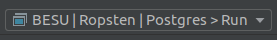

<h1 align="center">Exflo</h1>

<p align="center">
  <a href="https://github.com/41north/exflo/workflows/build/badge.svg">
    
  </a>
  <a href="https://img.shields.io/github/license/41north/exflo?style=flat-square">
    
  </a>
</p>

<p align="center">
    A plugin for the <a href="http://besu.hyperledger.org/en/stable/">Besu</a> enterprise-grade Ethereum client with the aim of making it easier to extract chain data into a variety of different data stores and processing pipelines. <br/> Written with ❤️ in <a href="https://kotlinlang.org">Kotlin</a>.
</p>

<p align="center"><b>⚠️ Warning</b>: This project is in alpha stage, and we are working actively!</p>

## 🗒️ Features 

Exflo can extract the following information from a Besu archive instance into either a [Postgres](https://www.postgresql.org/) database or a [Kafka](https://kafka.apache.org/) topic:

- Block headers.
- Transactions.
- Transaction traces.
- Log events for standards-compliant [ERC20](https://eips.ethereum.org/EIPS/eip-20), [ERC721](https://eips.ethereum.org/EIPS/eip-721), [ERC777](https://eips.ethereum.org/EIPS/eip-777) and [ERC1155](https://eips.ethereum.org/EIPS/eip-1155) tokens.
- A detailed breakdown of Ether movements e.g. block rewards, tx fees, simple ether transfers and so on.
- Contract creations and self-destructs.
- Per block account state changes.

Some screenshots of captured data:

| Plugin        | Screenshots        |
| ------------- |:------------------:|
| Postgres      | <p></p> |
| Kafka         | TBW      |

## ⏲️ Try Exflo in 10 seconds

We offer two `docker-compose` files [ready to launch Exflo](docker/exflo/) on Ethereum's Ropsten network (and easily configurable to 
other networks). Choose your flavor!

<details>
<summary>Postgres</summary>

```bash
docker-compose -f docker/exflo/docker-compose.postgres.yml up
```
</details>

<details>
<summary>Kafka</summary>

```bash
docker-compose -f docker/exflo/docker-compose.kafka.yml up
```
</details>

Wait for docker to properly initialize each service. Once everything is ready just navigate to 
[`http://localhost:8082`](http://localhost:8082), you will be greeted with either [`pgweb`](https://sosedoff.github.io/pgweb/) or 
[`kafkahq`](https://akhq.io/) respectively and, luckily, with Exflo processing data! 

## 🚆 Development quick start

First and foremost, ensure you have the following programs installed in your system:

* Java 11 or higher ([AdoptOpenJDK](https://adoptopenjdk.net/), [Zulu Community](https://www.azul.com/products/zulu-community/) or [OpenJDK](https://openjdk.java.net/))
* [Docker](https://docs.docker.com/install/)
* [Docker Compose](https://docs.docker.com/compose/install/)
* [direnv](https://github.com/direnv/direnv/blob/master/docs/installation.md)
* (Optional but highly recommendable) [IntelliJ IDEA Community or Ultimate](https://www.jetbrains.com/)

Clone the repository:

```bash
git clone git@github.com:41north/exflo.git
```

Generate Intellij run configurations (it will read from the file [`intellij-run-configs.yml`](intellij-run-configs.yml) and auto populate 
configurations to ease common operations inside the IDE):

```bash
./gradlew generateIntellijRunConfigs
```

Decide which data store you want to run:

<details>
<summary>Postgres</summary>

```bash
docker-compose -f docker-compose.exflo-postgres.yml up
```
</details>

<details>
<summary>Kafka</summary>

```bash
docker-compose -f docker-compose.exflo-kafka.yml up
```
</details>

Wait for each docker service to be properly initialized (being those Postgres or Kafka respectively). 

After that, inside Intellij, execute accordingly the Run config (there are other networks available, so select whichever you like):

<details>
<summary>Postgres</summary>


</details>

<details>
<summary>Kafka</summary>


</details>

Exflo will start processing. You can now check the logs or open your browser and navigate to [`http://localhost:8082`](http://localhost:8082) 
and you will be greeted with either [`pgweb`](https://sosedoff.github.io/pgweb/) or [`kafkahq`](https://akhq.io/) respectively.

## Usage with Besu

There are two possible ways of running Exflo with Besu. Choose whatever method suits you for your particular use-case and necessities:

### Bundled docker images

We offer bundled docker images with Besu to make your life easier. This is the recommended way of running Exflo as you don't need to 
worry about placing the plugin for Besu. Below there's an example using `docker-compose` syntax:

```yaml
version: '3.7'
services:
  besu:
    image: 41north/exflo:latest
    environment:
      BESU_LOGGING: INFO
      BESU_NETWORK: ROPSTEN
      BESU_SYNC_MODE: FULL
      BESU_DATA_PATH: /opt/besu/data
      BESU_PLUGIN_EXFLO_KAFKA_ENABLED: 'false'
      BESU_PLUGIN_EXFLO_POSTGRES_ENABLED: 'true'
      BESU_PLUGIN_EXFLO_POSTGRES_JDBC_URL: jdbc:postgresql://postgres/exflo?user=exflo&password=exflo
```

Have a look on the [usage section](.github/USAGE.md), so you can tweak easily the params to your liking.

### Jar

If you are already using Besu with other plugins, or you want to customize further the settings, using the JARs directly is another 
possibility. Below are instructions assuming you are running Besu within docker: 

1. Go to [releases](https://github.com/41North/exflo/releases) and download the `tar` or `zip` file and extract it.
2. [Besu docker image](https://hub.docker.com/r/hyperledger/besu) exposes a `/etc/besu/plugins` folder where it loads the jars.
3. Add a bind volume where to put Exflo's jar.
4. If you want to tweak default params, we recommend you to take a look on the [usage section](.github/USAGE.md).

Here's an example of a possible docker configuration using `docker-compose` syntax:

```yaml
version: '3.7'
services:
  besu:
    image: hyperledger/besu:1.4.4
    volumes:
      - ./path/to/exflo-jar/:/etc/besu/plugins
    environment:
      BESU_LOGGING: INFO
      BESU_NETWORK: ROPSTEN
      BESU_SYNC_MODE: FULL
      BESU_DATA_PATH: /opt/besu/data
      BESU_PLUGIN_EXFLO_KAFKA_ENABLED: 'false'
      BESU_PLUGIN_EXFLO_POSTGRES_ENABLED: 'true'
      BESU_PLUGIN_EXFLO_POSTGRES_JDBC_URL: jdbc:postgresql://postgres/exflo?user=exflo&password=exflo
```

Have a look on the [usage section](.github/USAGE.md), so you can tweak easily the params to your liking.

## 💻 Contribute

We welcome any kind of contribution or support to this project but before to do so:

* Read our [development guide](/.github/DEVELOPMENT.md) to understand how to properly develop on the codebase.
* Make sure you have read the [contribution guide](/.github/CONTRIBUTING.md) for more details on how to submit a good PR (pull request).

Also, we are not only limited to technical contributions. Things that make us happy are:

* Add a [GitHub Star 🌟](https://github.com/41north/exflo/stargazers) to the project.
* ETH donations to [this address](https://etherscan.io/address/0xcee9ad6d00237e25A945D7ac2f7532C602d265Df)!
* Tweet about this project.
* Write a review or tutorial:
    - [Exflo: A plugin for Hyperledger Besu](https://41north.dev/blog/open-source/exflo-a-plugin-for-hyperledger-besu/)

## ❔ FAQ

### Why Besu?

We chose Besu for several reasons:

1. It is enterprise ready.
2. It is written in Java, which allows us to work in Kotlin
3. It has a modern codebase with good patterns and documentation.
4. There is a plugin system allowing for customisation and integration without the need to maintain a fork.
5. Their [community is open and welcoming](https://chat.hyperledger.org/channel/besu) (we recommend you join!).

### Why not use the Web3 interface that every Ethereum client has?

If you have ever tried this you will quickly realise that extracting even just the basic information from an Ethereum client via the Web3 
interface requires a lot of requests, and some non-trivial logic to do well. On top of that, depending on the client 
(we won't name anyone in particular) you may find that under heavy load, such as when syncing for the first time, your client may become 
unstable and periodically core dump. Maximising throughput whilst keeping the client happy quickly becomes a tedious exercise.

Put simply it has been our experience that pulling via the Web3 interface is sub-optimal for a variety reasons which are better explored 
in a blog post.

### Why Postgres and Kafka? Is it possible to develop more data stores?

Majority of people will find very useful to externalise the internal information that a typical Ethereum node stores. Postgres and Kafka 
are well-known data store technologies (each of one serving different purposes and necessities) that are often used to perform
better queries or real-time analytics.

Having said that. Yes, we thought originally on Exflo to be easily extendable so, if you find another possible use-case let us know!

### Can we replace RocksDB storage engine that Besu uses with the Postgres' one inside Exflo?

As far as we know, Besu originally had planned support to add Postgres directly as a storage plugin. To us, Exflo is considered a 
second class storage to Besu that complements and adds more meaning, so we don't see it replacing RocksDB (for multiple obvious reasons and 
one of them being performance).

## 📬 Get in touch

`Exflo` has been developed initially by [°41North](https://41north.dev). 

If you think this project would be useful for your use case and want to talk more about it you can reach out to us via our contact form 
or by sending an email to `hello@41north.dev`. We try to respond within 48 hours and look forward to hearing from you.

## ✍️ License

This project is licensed under the Apache 2.0 License - see the [LICENSE](LICENSE) file for details.
